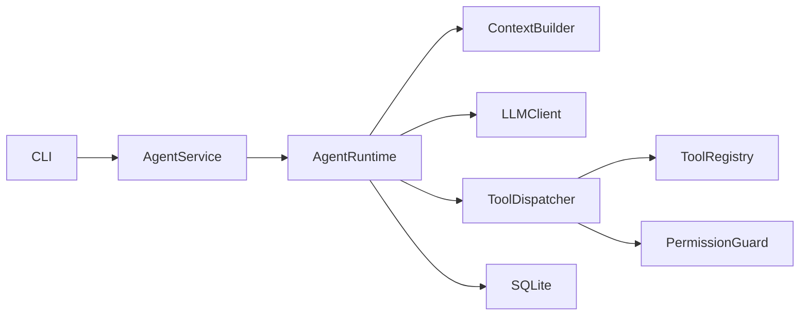

# MiniCode Harness

MiniCode Harness 是一个自主实现的最小 Coding Agent Runtime。它通过 OpenAI-compatible LLM 和原生 Function Calling 调用模型，但自行实现 Agent Loop、上下文组装、工具系统、权限检查、持久化、任务恢复与执行 Trace。

项目不使用 LangChain、LangGraph、OpenHands、CrewAI、AutoGen 或其他现成 Agent Runtime。

代码仓库：[panding999/MiniCode-Harness](https://github.com/panding999/MiniCode-Harness)

## 架构



## 安装

项目要求 Python 3.11 或更高版本。

```bash
python -m pip install -e ".[dev]"
copy .env.example .env
```

项目启动时会自动读取根目录下的 `.env`。使用 DeepSeek V4 Pro 时，只需将 `.env` 中的 `LLM_API_KEY` 替换为真实 Key。请勿将真实 API Key 提交到代码仓库。

`.env` 查找顺序为：当前 Workspace、`~/.minicode/.env`、MiniCode 安装项目根目录。也可以通过 `MINICODE_ENV_FILE` 指定配置文件。相对 SQLite 路径会固定到 `.env` 所在目录，不会因启动目录不同而切换数据库。

## CLI 使用方式

首次安装并配置终端命令：

```powershell
.\install.ps1
```

安装后进入任意项目目录，直接运行：

```powershell
minicode
```

MiniCode 会使用当前目录作为 Workspace，并根据目录路径自动生成稳定的 Session ID。以后在相同目录再次运行 `minicode`，会继续使用相同 Session。

交互界面使用 Rich 渲染欢迎面板、等待 Spinner、工具调用状态和流式答案。输入问题后，终端会实时展示当前思考步骤与工具执行结果，不再静默等待整轮完成。

聊天界面内可使用：

```text
/help       查看命令
/task       查看当前任务
/trace      查看当前 Session 的执行记录
/sessions   查看所有 Session
/exit       退出
```

完整命令形式：

```bash
minicode chat --workspace ./workspace/demo_project --session demo
minicode trace --session demo
minicode task --session demo
minicode sessions
```

使用 `--message "..."` 可以执行单轮非交互请求。不传入该参数时，`chat` 会保持交互状态，直到用户输入空行为止。

如果用户级 Python Scripts 目录不在 `PATH` 中，可以使用 `python -m minicode.cli` 代替 `minicode`：

```bash
python -m minicode.cli chat --workspace ./workspace/demo_project --session demo
```

## Runtime 工作流程

每轮请求会加载：

1. Core Instructions；
2. Workspace 中的 `AGENT.md`；
3. 当前 Active Task Ledger；
4. Session Summary；
5. 最近的完整消息。

Runtime 随后调用 LLM，校验并执行模型返回的工具调用，将 Observation 持久化并回填给 LLM，直到模型返回最终答案或触发安全停止条件。

当前提供以下工具：

- `list_files`：列出 Workspace 文件；
- `read_file`：按行读取文件；
- `search_code`：搜索代码内容；
- `write_file`：创建或覆盖文件；
- `run_command`：执行白名单命令。

`run_command` 不会启动 Shell，仅允许执行 `python`、`python3`、`pytest`、`git status` 和 `git diff`。所有文件路径解析后都必须位于当前 Workspace 内。覆盖已有文件前，Agent 必须先通过 `read_file` 读取该文件。

## Session、Task Ledger 与 Trace

系统使用 SQLite 保存：

- Session；
- 对话消息；
- Task Ledger；
- 每轮 Run；
- Trace Event。

文件读取、文件修改、执行命令、错误和测试结果等客观执行信息由 Runtime 根据工具结果自动记录，而不是依赖 LLM 自述。

出现以下情况时，当前任务会被设置为 `paused`：

- 用户要求只定位问题，不进行修改；
- 达到最大执行步数；
- 相同工具和参数连续调用三次。

后续使用相同 Session ID 发起请求时，Runtime 会恢复最近的 Task Ledger，并基于已有状态继续执行。

## 三轮跨轮演示

启动 CLI：

```bash
python -m minicode.cli chat --workspace ./workspace/demo_project --session demo
```

依次输入以下指令：

1. `检查除法功能为什么在除数为 0 时崩溃。只定位问题，不修改代码。`
2. 退出并使用相同 Session 重新启动 CLI，然后输入：`继续刚才的任务，修复问题并运行测试。`
3. `刚才修改了什么？`

演示结束后查看 Task Ledger 和 Trace：

```bash
python -m minicode.cli task --session demo
python -m minicode.cli trace --session demo
python -m pytest -q
```

录屏前需要将 `workspace/demo_project/calculator.py` 恢复为最初存在除零缺陷的两行实现，并删除本地 `minicode.db`，确保演示从干净状态开始。完整录屏步骤参见 `RECORDING.md`。

## 测试

运行 Harness 自动化测试：

```bash
python -m pytest -q
```

运行演示项目测试：

```bash
python -m pytest workspace/demo_project -q
```

Runtime 自动化测试使用 `FakeLLMClient`，因此测试结果稳定且不会产生 API 费用。真实 LLM API 使用 OpenAI-compatible `stream=True` 流式响应，仅用于手工 Smoke Test 和最终录屏演示。

初始状态下，演示项目的除零测试应当失败；该失败用于展示 Agent 定位、暂停、恢复、修复并重新运行测试的完整过程。

## Context Compaction

当 Session 中保存的消息超过 30 条时，MiniCode 会生成简化的近期历史摘要，并保留最近 12 条完整消息。

Active Task Ledger 始终以结构化形式保留，不参与压缩。MVP 使用确定性的简化摘要机制，避免为了摘要额外调用 LLM；未来可以在相同接口下替换为 LLM Summary。

## 安全边界

- 所有文件操作都限制在指定 Workspace 内；
- 路径解析后再次检查，阻止 `..` 路径穿越和 Workspace 外访问；
- `run_command` 使用参数数组和 `shell=False`；
- 命令必须在白名单中；
- 工具执行成功、失败或被拒绝都会写入 Trace；
- 所有命令都有超时限制。

该权限系统用于展示最小安全边界，不等同于完整的操作系统级沙箱。

## 已知限制

- 暂不提供 Web UI 和人工审批 UI；
- 暂不支持容器沙箱、并行工具调用和 Multi-Agent；
- 文件修改采用完整文件写入，而不是 Patch；
- 命令白名单只能降低风险，不能替代操作系统沙箱；
- 作为从零实现的 MVP，暂不提供 SQLite Schema Migration；
- 每个 Session 默认持续使用最近的 Task Ledger。

## 笔试要求覆盖

| 笔试要求 | MiniCode Harness 实现 |
|---|---|
| 多轮对话和 Session 维护 | SQLite 持久化 Session、消息与稳定 Session ID |
| 不依赖现成 Agent 框架 | 自主实现 Runtime、Context Builder、Tool Dispatcher |
| 自行实现 Agent Loop | Runtime 循环完成 LLM、工具、Observation 和最终回答编排 |
| 至少三个工具 | 提供五个 Coding Tools |
| 最大步数、异常处理和 Trace | `MAX_STEPS`、结构化 Tool Result、SQLite Trace |
| 跨轮次继续执行 | Task Ledger 支持 paused、恢复、完成与历史查询 |
| 调用真实 LLM API | DeepSeek/OpenAI-compatible API 与原生 Function Calling |
| README、录屏、AI 记录 | `README.md`、`RECORDING.md`、`AI_NOTES.md` |

## 项目文档

- `README.md`：项目说明、使用方法与演示流程；
- `AI_NOTES.md`：AI 使用记录、关键决策与问题解决记录；
- `RECORDING.md`：操作录屏脚本；
- `prompts/system.md`：Core Instructions；
- `workspace/AGENT.md`：演示 Workspace 的项目级 Memory。
