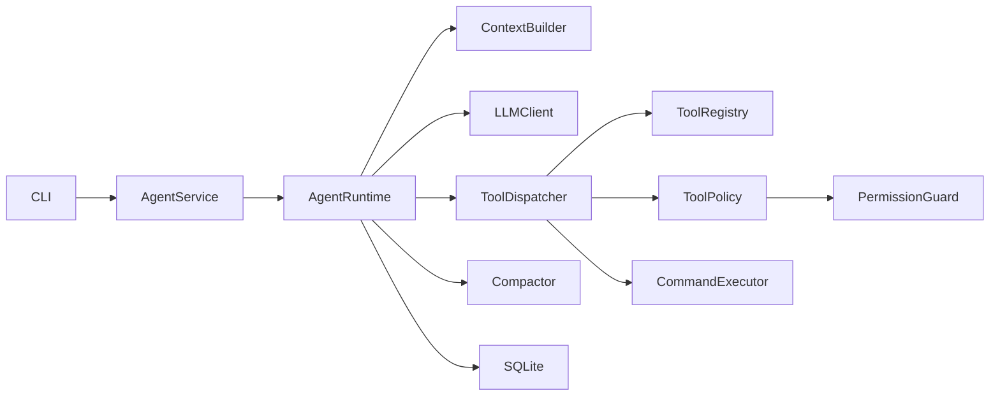

# MiniCode Harness

代码链接：[panding999/MiniCode-Harness](https://github.com/panding999/MiniCode-Harness)

终端操作录屏：[recordings/minicode-demo.mp4](recordings/minicode-demo.mp4)

AI Prompt 与问题解决记录：[AI_NOTES.md](AI_NOTES.md)

MiniCode Harness 是一个自主实现的最小 Coding Agent Runtime。它通过 OpenAI-compatible LLM 和原生 Function Calling 调用模型，但自行实现 Agent Loop、上下文组装、工具系统、权限检查、持久化、任务恢复与执行 Trace。

项目不使用 LangChain、LangGraph、OpenHands、CrewAI、AutoGen 或其他现成 Agent Runtime。

## 运行方式

项目要求 Python 3.11 或更高版本。

```bash
python -m pip install -e ".[dev]"
copy .env.example .env
```

项目启动时会自动读取 `.env`。使用 DeepSeek V4 Pro 或其他 OpenAI-compatible 服务时，需要配置：

```env
LLM_API_KEY=...
LLM_MODEL=...
LLM_BASE_URL=...
```

请勿将真实 API Key 提交到代码仓库。

`.env` 查找顺序为：当前 Workspace、`~/.minicode/.env`、MiniCode 安装项目根目录。也可以通过 `MINICODE_ENV_FILE` 指定配置文件。相对 SQLite 路径会固定到 `.env` 所在目录，不会因启动目录不同而切换数据库。

首次安装并配置终端命令：

```powershell
.\install.ps1
```

安装后进入任意项目目录，直接运行：

```powershell
minicode
```

MiniCode 会使用当前目录作为 Workspace，并在每次直接运行 `minicode` 时创建一个新的空白 Session。新 Session 的 `/task` 和 `/trace` 初始为空；如需回到历史对话，可在聊天中使用 `/sessions` 选择，或通过 `--session` 显式指定已有 Session ID。

常用命令：

```bash
minicode
minicode chat --workspace ./workspace/demo_project --session demo
minicode chat --workspace ./workspace/demo_project --session demo --message "只回复：测试"
minicode task --session demo
minicode trace --session demo
minicode sessions
```

如果用户级 Python Scripts 目录不在 `PATH` 中，可以使用 `python -m minicode.cli` 代替 `minicode`：

```bash
python -m minicode.cli chat --workspace ./workspace/demo_project --session demo
```

聊天界面内可使用：

```text
/help       查看命令
/task       查看当前任务
/trace      查看当前 Session 的执行记录
/sessions   查看所有 Session
/rename 名称 重命名当前 Session
/exit       退出
```

`/sessions` 会打开交互式 Session 选择器。使用上下方向键移动，按 Enter 切换到高亮 Session，按 Esc 返回且不改变当前 Session。选择历史 Session 时，MiniCode 会切换到该 Session 保存的 Workspace，并重放最近历史对话；选择 `+ New session` 会在当前 Workspace 创建空白新会话。

`/rename new-session-name` 会重命名当前 Session，并同步更新该 Session 关联的 messages、Task Ledger、runs 和 trace events。

## 系统设计

MiniCode 的核心目标是把一个 Coding Agent 的关键运行链路拆开并自己实现：输入、上下文、模型、工具、权限、持久化、任务恢复和 Trace 都有明确模块负责。



主要模块职责：

| 模块 | 位置 | 职责 |
|---|---|---|
| CLI / Terminal UI | `minicode/cli.py`, `minicode/terminal_ui.py` | 命令解析、交互输入、流式输出、工具状态、审批、Session 选择 |
| AgentService | `minicode/service.py` | 装配 LLM、Runtime、Repository、ToolRegistry、Dispatcher、Compactor |
| AgentRuntime | `minicode/runtime/agent_loop.py` | 实现 Agent Loop，编排 LLM 调用、工具执行、Observation 回填和停止条件 |
| ContextBuilder | `minicode/runtime/context_builder.py` | 构建发送给 LLM 的 system message 和 recent messages |
| Compactor | `minicode/runtime/compactor.py` | 压缩旧工具输出和旧对话，控制上下文长度 |
| LLM Client | `minicode/llm/` | 适配 OpenAI-compatible streaming API，并提供 FakeLLM 用于测试 |
| Tool System | `minicode/tools/` | 定义工具 schema、注册工具、执行文件/搜索/命令工具 |
| Permission System | `minicode/permissions/` | 限制路径、命令和高风险操作 |
| Persistence | `minicode/persistence/` | 使用 SQLite 保存 Session、Message、Task、Run、Trace |

一轮请求的运行流程：

1. CLI 接收用户输入；
2. Runtime 保存 user message；
3. Runtime 读取或创建当前 Session 和 Task Ledger；
4. Compactor 必要时压缩旧上下文；
5. ContextBuilder 组装 Core Instructions、Memory、Task Ledger、Session Summary 和最近消息；
6. LLM 返回最终答案或 Function Calling 工具调用；
7. ToolDispatcher 先经过权限策略，再执行工具；
8. 工具结果作为 Observation 保存到 messages，并写入 Trace；
9. Runtime 根据工具结果更新 Task Ledger；
10. 如果还需要继续，Runtime 重新构建上下文并进入下一步；
11. 模型返回最终答案后，Runtime 保存 assistant message，更新任务状态并结束 Run。

停止条件包括：

- 模型返回最终答案；
- 达到最大执行步数；
- 相同工具和参数连续调用三次；
- 高风险操作被用户拒绝；
- 策略直接拒绝危险操作；
- 未处理异常发生。

出现异常时，Runtime 会先把 Task 标记为 failed，写入 `run_failed` Trace 并结束 Run，然后再把错误交给 CLI 展示。

## Memory 召回与放置方式

MiniCode 的 Memory 不是单一的向量库，而是由 Runtime 在每次 LLM 调用前确定性组装。召回时机是：**每一步调用 LLM 之前**。也就是说，模型不是主动查询 Memory，而是 Runtime 主动把当前应该知道的信息放进上下文。

Memory 分为四层：

| Memory 类型 | 来源 | 作用 |
|---|---|---|
| Project Memory | Workspace 中的 `AGENT.md` | 项目规则、目录说明、长期约束 |
| Task Memory | 当前 Session 的 Task Ledger | 当前目标、任务状态、读过文件、改过文件、运行命令、测试结果和错误 |
| Session Summary | `sessions.summary` | 被压缩的旧对话摘要 |
| Recent Messages | `messages` 表 | 最近完整 user / assistant / tool 消息 |

这些信息的放置方式是：

```text
system message:
  Core Instructions
  PROJECT MEMORY: AGENT.md
  WORKSPACE: 当前 Workspace 绝对路径
  ACTIVE TASK LEDGER: 当前任务 JSON
  SESSION SUMMARY: 历史摘要

followed by:
  recent user / assistant / tool messages
```

这样设计的原因：

- Project Memory 和 Task Ledger 是运行约束与事实状态，比普通聊天消息更适合放在 system context 中；
- Task Ledger 是结构化状态，跨进程恢复时比单纯依赖聊天历史更可靠；
- Session Summary 让旧对话仍能影响后续推理，但不会无限增长；
- Recent Messages 保留最近完整交互，避免丢失最新用户意图和工具 Observation。

当前没有引入向量检索，是因为这个最小 Runtime 的关键状态都能确定性获得：Workspace、`AGENT.md`、Task Ledger、Session Summary 和最近消息。确定性召回更容易测试、解释和录屏展示。

## 工具系统

当前提供以下工具：

- `list_files`：列出 Workspace 文件；
- `read_file`：按行读取文件；
- `search_code`：搜索代码内容；
- `write_file`：创建或覆盖文件；
- `delete_file`：经过权限策略审批后删除单个文件；
- `run_command`：执行白名单命令。

工具参数由 Pydantic 模型定义，并自动生成 Function Calling schema。Runtime 把所有工具 schema 传给 LLM，模型返回 tool call 后由 `ToolDispatcher` 统一执行。

`write_file` 修改已有文件前，要求 Agent 必须先通过 `read_file` 读取该文件。这是为了避免模型在不了解当前内容时直接覆盖文件。

`run_command` 不会启动 Shell，仅允许执行 `python`、`python3`、`pytest`、`git status` 和 `git diff`。命令以参数数组形式传入，便于权限检查和 Trace 记录。

## Session、任务账本与执行追踪

系统使用 SQLite 保存：

- Session；
- 对话消息；
- Task Ledger；
- 每轮 Run；
- Trace Event。

文件读取、文件修改、执行命令、错误和测试结果等客观执行信息由 Runtime 根据工具结果自动记录，而不是依赖 LLM 自述。

Task Ledger 保存当前任务的结构化状态，包括：

- goal；
- status；
- summary；
- next_action；
- files_read；
- files_changed；
- commands_run；
- test_result；
- last_error。

出现以下情况时，当前任务会被设置为 `paused`：

- 用户要求只定位问题，不进行修改；
- 达到最大执行步数；
- 相同工具和参数连续调用三次；
- 高风险操作被拒绝或策略拒绝。

后续使用相同 Session ID 发起请求时，Runtime 会恢复最近的 Task Ledger，并基于已有状态继续执行。

Trace 记录每一步 LLM 响应、工具结果、权限决策、暂停和失败，便于调试和录屏展示。

## 上下文压缩

MiniCode 使用两层渐进式上下文压缩：

1. 构建上下文时，将较旧的工具结果替换为短占位符，同时保持 Function Calling 消息配对；
2. 未压缩消息超过字符预算时，将较旧消息整理为累计结构化摘要，最近消息保持完整。

SQLite 始终保留全部原始消息，压缩只影响发送给 LLM 的上下文视图。详细设计和取舍参见 [`HIGHLIGHTS.md`](HIGHLIGHTS.md) 中的“亮点一：两层渐进式上下文压缩”。

## 安全边界

- 所有文件操作都限制在指定 Workspace 内；
- 路径解析后再次检查，阻止 `..` 路径穿越和 Workspace 外访问；
- `run_command` 使用参数数组和 `shell=False`；
- 命令必须在白名单中；
- 工具执行成功、失败或被拒绝都会写入 Trace；
- 所有命令都有超时限制；
- 本地命令执行器只传递环境变量白名单，并限制输出大小；
- Docker 命令执行器支持非 root、禁用网络、只读根文件系统及 CPU、内存、PID 限制；
- 任意未处理异常都会先将 Run、Task 和 `run_failed` Trace 收尾，再向 CLI 抛出。

所有工具都会经过轻量策略入口，但常规只读、Workspace 内普通写入和安全白名单命令会自动放行。敏感文件写入和普通文件删除会在交互模式中请求人工审批；敏感文件删除、目录删除和明显危险命令直接拒绝。

本地模式属于纵深防御，不等同于完整的操作系统级沙箱。需要真正隔离时，可配置：

```env
COMMAND_EXECUTOR=docker
```

## 三轮跨轮演示

启动 CLI：

```bash
python -m minicode.cli chat --workspace ./workspace/demo_project --session demo
```

依次输入以下指令：

1. `检查除法功能为什么在除数为 0 时崩溃。只定位问题，不修改代码。`
2. 退出并使用相同 Session 重新启动 CLI，然后输入：`继续刚才的任务，修复问题并运行测试。`
3. `刚才修改了什么？`

演示结束后查看 Task Ledger 和 Trace：

```bash
python -m minicode.cli task --session demo
python -m minicode.cli trace --session demo
python -m pytest -q
```

录屏前需要将 `workspace/demo_project/calculator.py` 恢复为最初存在除零缺陷的两行实现，并删除本地 `minicode.db`，确保演示从干净状态开始。完整录屏步骤参见 [`RECORDING.md`](RECORDING.md)。

## 测试

运行 Harness 自动化测试：

```bash
python -m pytest -q
```

运行演示项目测试：

```bash
python -m pytest workspace/demo_project -q
```

Runtime 自动化测试使用 `FakeLLMClient`，因此测试结果稳定且不会产生 API 费用。真实 LLM API 使用 OpenAI-compatible `stream=True` 流式响应，仅用于手工 Smoke Test 和最终录屏演示。

需要亲自操作真实 MiniCode、保存验收数据并直观看到 Session、任务和 Trace 时，请按照 [`MANUAL_TESTING.md`](MANUAL_TESTING.md) 逐项执行。

每个自动化测试的测试目标、测试数据、模拟输入、关键断言和人工验收步骤详见 [`TESTING.md`](TESTING.md)。

## 已知限制

- 暂不提供 Web UI；
- Docker 隔离依赖本机已安装 Docker 和合适的运行镜像；
- 暂不支持并行工具调用和 Multi-Agent；
- 文件修改采用完整文件写入，而不是 Patch；
- 本地命令限制不能替代 Docker 等操作系统级隔离；
- 作为从零实现的 MVP，暂不提供 SQLite Schema Migration；
- 每个 Session 只会自动恢复 paused 任务；completed/failed 后的新输入会创建新的 Task Ledger。

## 笔试要求覆盖

| 笔试要求 | MiniCode Harness 实现 |
|---|---|
| README 说明运行方式 | 提供安装、配置、交互模式、显式 Session、Task、Trace、Sessions 命令 |
| README 说明系统设计 | 展示模块架构、Runtime 流程、工具系统、持久化、上下文压缩和安全边界 |
| README 说明 Memory 召回与放置方式 | 明确每次 LLM 调用前召回 Project Memory、Task Memory、Session Summary 和 Recent Messages，并说明放入 system message |
| 多轮对话和 Session 维护 | SQLite 持久化 Session 和消息；默认新建空白 Session，并支持通过 `/sessions` 或 `--session` 恢复历史 |
| 不依赖现成 Agent 框架 | 自主实现 Runtime、Context Builder、Tool Dispatcher |
| 自行实现 Agent Loop | Runtime 循环完成 LLM、工具、Observation 和最终回答编排 |
| 至少三个工具 | 提供六个 Coding Tools |
| 最大步数、异常处理和 Trace | `MAX_STEPS`、结构化 Tool Result、SQLite Trace |
| 跨轮次继续执行 | Task Ledger 支持 paused、恢复、完成与历史查询 |
| 调用真实 LLM API | DeepSeek/OpenAI-compatible API 与原生 Function Calling |
| README、录屏、AI 记录 | `README.md`、`RECORDING.md`、`AI_NOTES.md` |

## 项目文档

- `README.md`：运行方式、系统设计、Memory 召回与放置方式、演示流程；
- `AI_NOTES.md`：AI 使用记录、关键决策与问题解决记录；
- `RECORDING.md`：操作录屏脚本；
- `MANUAL_TESTING.md`：可保存真实数据、可直观看结果的手工验收指南；
- `TESTING.md`：测试数据、自动化测试说明与逐项验收步骤；
- `HIGHLIGHTS.md`：项目亮点、设计取舍与演示方式；
- `docs/AGENT_ARCHITECTURE.md`：本地架构深度说明；
- `prompts/system.md`：中文核心运行指令；
- `prompts/compact.md`：预留给未来 LLM 摘要器的中文历史压缩指令；
- `workspace/AGENT.md`：演示 Workspace 的项目级 Memory。
